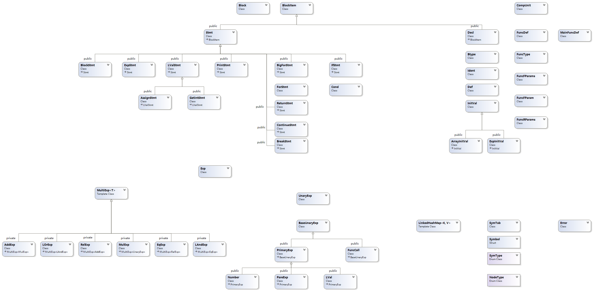

# BUAA 2023 编译器设计

## 总体介绍

本人编译器使用 C++17 编写(具体语言心得见后)，抽象语法树 AST 设计参照了 `https://github.com/dhy2000/Compiler2021` 。

### 总体结构

Lexer Parser 均使用 namespace 实现单例效果，仅向外暴露必要接口
(CppCoreGuidelines 不建议使用单例设计模式，冗余复杂不如namespace一步到位)

namespace Parser 仅包括输出函数和单词检验方法，具体的解析函数分散在各个节点类中。

### 接口设计

### 文件组织

### etc

## Lexer

### 单例模式

原仿照 java 实现`单例模式`。后修改，CPP 更适合使用 namespace 实现单例效果。

### 预读处理
Lexer 无需为`预读处理`额外扫描。

Lexer 应当领先 Parser 若干个 单词(具体领先数量依据设计而定，单词信息均存储于 Lexer 内部)。  

Lexer 共存储 3 个单词(便于 Parser 预读分析，具体深度在 Parser 设计中确定)，分别记录每个单词的位置数据(错误处理)。

在读取新单词时，依次更新各个单词信息。

由此优化， Lexer 仅会扫描全文一遍，预读不会影响性能。  

### 词法类型

之前的 Lexer 为了方便输出，直接将 `LexType` 定义为 `std::string`。  
开发 Parser 考虑建造语法树时，如果使用 `string` 作为节点标识符，效率太低。   
后现将 LexType 和 SynType 重构为枚举类，两者都是 `enum class NodeType` (语法树节点类型)。

```c++
// old
typedef std::string LexType;
// new
enum class NodeType {/*...*/}
```

### `标识符` 和 `保留字` 

为了简化代码实现，我借鉴了讨论区同学的 `LinkedHashMap`。
只需将保留字加入上述 map 中，在区分时依次判断即可，无需实现状态机区分保留字。
CPP 标准库没有 JAVA 的 LinkedHashMap，我使用模板类实现(仅功能实现，未优化)。

## Parser

### 抽象语法树 AST

原设计：AST 的节点均为一个类，该类成员属性包含一个 `NodeType` 用以区分不同节点。
使用 unordered_map<Node* , 具体属性>表示结点的属性信息(如果在节点内部直接存储信息，每个节点都要包含所有可能的信息，浪费内存)。

上述设计是可行的，但是每次访问属性都要访问指针，破坏了缓存连续性，代码运行效率低，不优雅。

在阅读了往届同学和 Clang 源代码后，我决定重构 AST，当为每个非终结符设置一个类。

多个节点类间使用继承降低复杂度、复用代码，类继承关系图(Visual Studio生成类图)如下所示。



### 解析

解析方法分散在各个节点类中，作为类的静态方法，使用递归下降法解析。

### Const

我的节点中，将 `cons` 作为 Exp InitVal 的属性，解析时需要向下传递 `cons`。

文法规定中，Exp ConstExp没有区分(AST 中，ConstExp 下的节点不为 const)，额外在语义中语义约束。

在后续分析时需要注意。

```
Exp → AddExp
ConstExp → AddExp
```

## SymTable

栈式符号表，记录当前符号表指针和顶层 global 符号表指针。

符号表中，使用 unordered_map 将`标识符名`映射到`符号表项`

for 语句的 (...) 与 {...} 是同一个作用域，专题报告有错。

### 常值计算
符号表填表中，需要解析数组维度，进行常量计算。

### 符号表作用域修改
符号表深度修改位置： `FuncDef` `MainFuncDef` `BigForStmt` `IfStmt` `BlockStmt` (不是在 `block` 内!)

## Error Handling

Lexer 记录错误位置，在语法分析中完成错误判断、处理。

## C++ 坑

### Singleton

Singleton 中，单例变量初始化要放在源文件(放在头文件可能导致多次初始化错误)

[Union 中 gcc clang 编译器实现“错误”](https://stackoverflow.com/questions/70428563/unions-default-constructor-is-implicitly-deleted)
union 的 C++标准没说清楚，编译器厂商实现不一样！
c++ 17 应该使用 variant 替代 union。

### include 原则

头文件应当尽可能少地 include，以减少编译时间。
区分头文件和源代码的 include。
必要时使用前置声明避免循环include。(使用module即可避免，可惜课程组要求的 C++17 不支持)

### Cmake

学习 Cmake 构建 cpp 工程。makefile 过于原始，不够现代。**